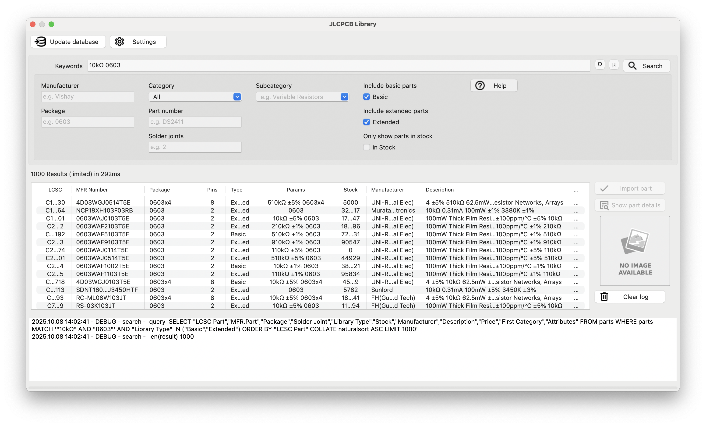
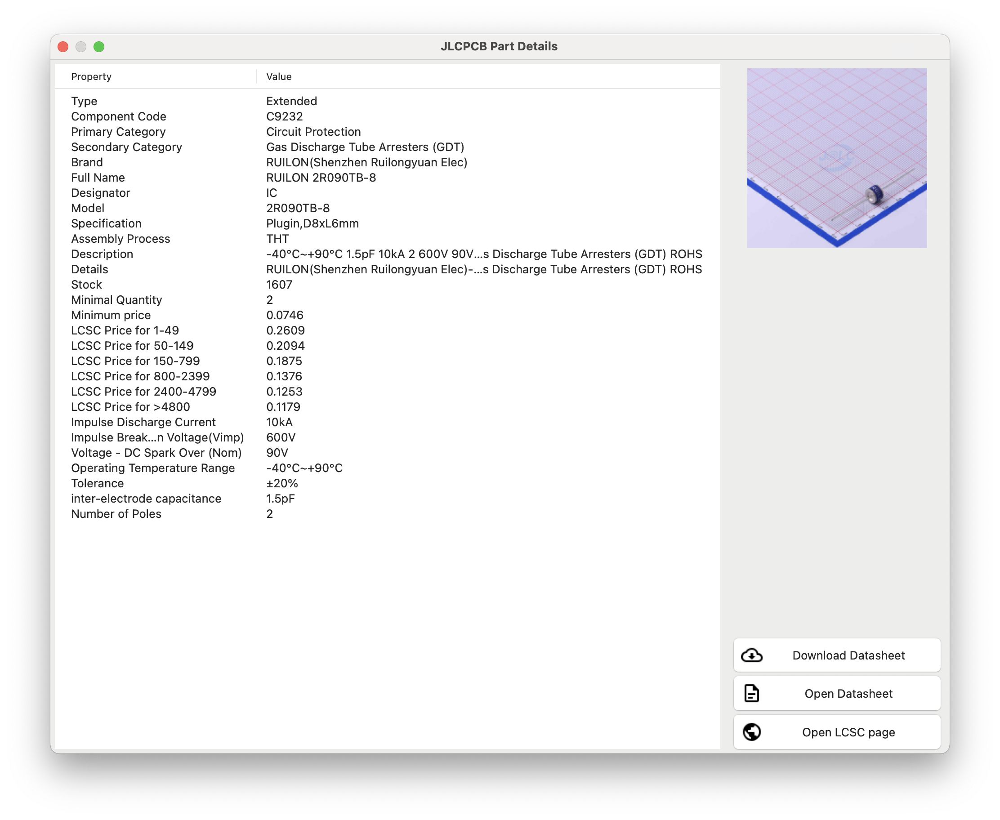
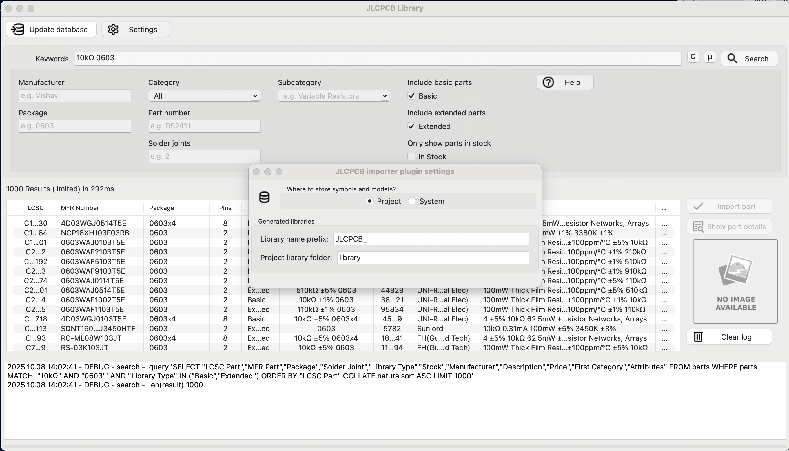
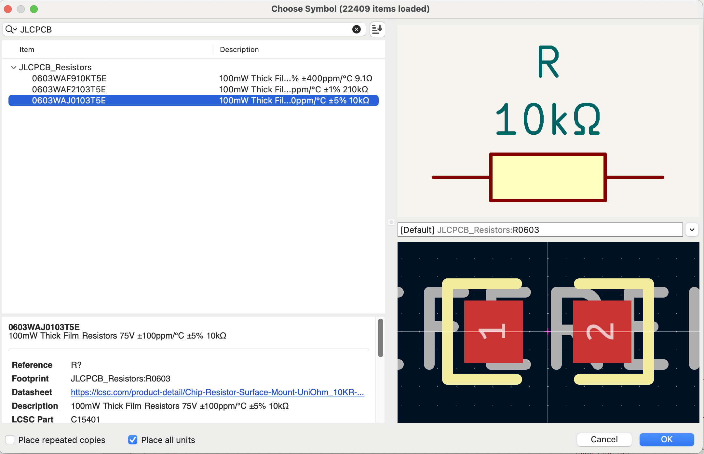
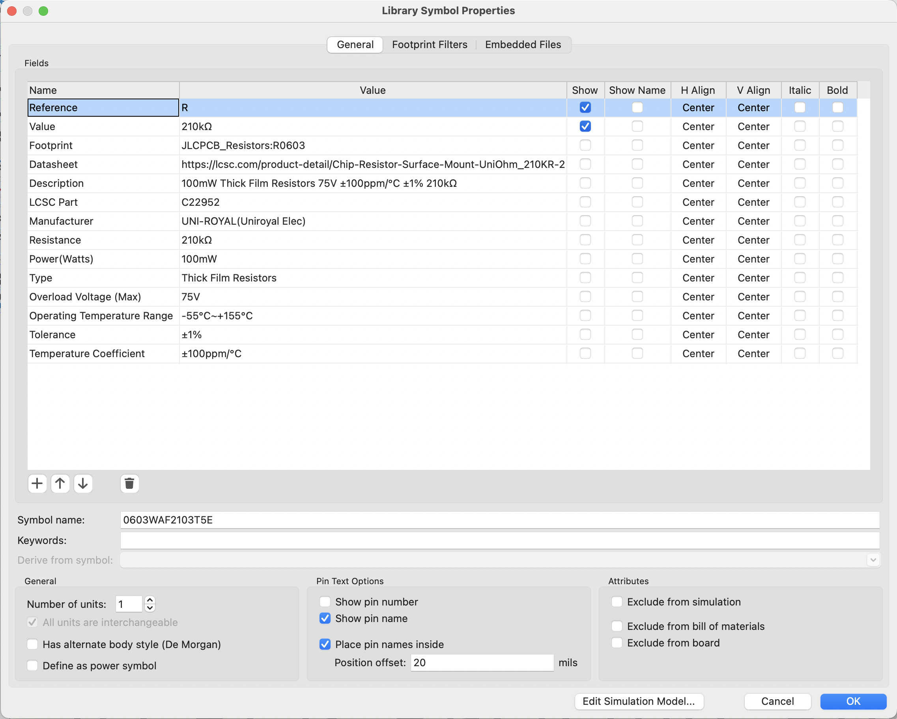

# KiCad JLCPCB Importer

Thanks and credit to the original project that inspired this work: https://github.com/Bouni/kicad-jlcpcb-tools

- Tested with KiCad 9

What it does
- Search LCSC/JLCPCB catalog and assign LCSC numbers to footprints
- Import symbol, footprint and 3D model via easyeda2kicad for a selected LCSC part
- Choose where to store generated libraries: Project or System (KiCad 9 3rd‑party locations)
- Auto‑update project library tables (sym‑lib‑table / fp‑lib‑table) and fix 3D paths
- Configurable library prefix (default: `LCSC_`) and project library folder (default: `library`)

Screenshots
- Search: `images/search.png`



- Part details: `images/details.png`



- Settings: `images/settings.png`



- Symbol library: `images/symbol_library.png`



- Symbol properties: `images/symbol_properties.png`



## Installation 💾

### KiCAD PCM

Add my custom repo to *the Plugin and Content Manager*, the URL is:

```sh
https://raw.githubusercontent.com/NikolayMurha/kicad-repository/main/repository.json
```


From there you can install the plugin via the GUI.

### Git

Simply clone this repo into your `scripting/plugins` folder.

**Windows**

```sh
cd C:\users\<username>\Documents\kicad\<version>\scripting\plugins\  # <username> is your username, <version> can be 7.0, 8.0, or X.YY depending on the version you use
git clone https://github.com/NikolayMurha/kicad-jlcpcb-importer.git
```

**Linux**

```sh
cd /home/<username>/.local/share/kicad/<version>/scripting/plugins  # <version> can be 7.0, 8.0, or X.YY depending on the version you use
git clone https://github.com/NikolayMurha/kicad-jlcpcb-importer.git
```

**MacOS**

```sh
cd ~/Library/Preferences/kicad/scripting/plugins
git clone https://github.com/NikolayMurha/kicad-jlcpcb-importer.git
```

You may need to create the `scripting/plugins` folder if it does not exist.

### Flatpack :warning:

The Flatpak installation of KiCAD currently dows not ship with pip and requests installed. The later is required for the plugin to work.
In order to get it working you can run the following 3 commands:

1. `flatpak run --command=sh org.kicad.KiCad`
2. `python -m ensurepip --upgrade`
3. `/var/data/python/bin/pip3 install requests`

See [issue #94](https://github.com/Bouni/kicad-jlcpcb-tools/issues/94) for more info.

## Usage 🥳

To access the plugin choose `Tools → External Plugins → JLCPCB Tools` from the *PCB Editor* menus

Checkout this screencast, it shows quickly how to use this plugin:

> Note: usage instructions are intentionally omitted for now.

## System library locations (KiCad 9)

When you choose System as the storage location, generated libraries are placed under KiCad’s 3rd‑party folders.

- macOS
  - `/Users/<user>/Documents/KiCad/9.0/3rdparty/symbols/<plugin_dir_name>`
  - `/Users/<user>/Documents/KiCad/9.0/3rdparty/footprints/<plugin_dir_name>`
  - `/Users/<user>/Documents/KiCad/9.0/3rdparty/3dmodels/<plugin_dir_name>`

- Linux
  - `~/.local/share/kicad/9.0/3rdparty/symbols/<plugin_dir_name>`
  - `~/.local/share/kicad/9.0/3rdparty/footprints/<plugin_dir_name>`
  - `~/.local/share/kicad/9.0/3rdparty/3dmodels/<plugin_dir_name>`

- Windows
  - `%USERPROFILE%\Documents\KiCad\9.0\3rdparty\symbols\<plugin_dir_name>`
  - `%USERPROFILE%\Documents\KiCad\9.0\3rdparty\footprints\<plugin_dir_name>`
  - `%USERPROFILE%\Documents\KiCad\9.0\3rdparty\3dmodels\<plugin_dir_name>`

## Icons

This plugin makes use of a lot of icons from the excellent [Material Design Icons](https://materialdesignicons.com/)

## Development

1. Fork repo
2. Git clone forked repo
3. Install pre-commit `pip install pre-commit`
4. Setup pre-commit `pre-commit run`
5. Create feature branch `git switch -c my-awesome-feature`
6. Make your changes
7. Commit your changes `git commit -m "Awesome new feature"`
8. Push to GitHub `git push`
9. Create PR

Make sure you make use of pre-commit hooks in order to format everything nicely with `black`
In the near future I'll add `ruff` / `pylint` and possibly other pre-commit-hooks that enforce nice and clean code style.

## Notes

- This fork focuses on searching LCSC parts and importing KiCad libraries via easyeda2kicad.
- Fabrication (Gerber/CPL/BOM) features from the original tool are not included.

## python libraries

lib/ contains the necessary python packages that may not be a part of the KiCad python distribution.

These packages include:

- packaging

To install a package, such as 'packaging':

```python
pip install packaging --target ./lib
```

To update these packages:

```python
pip install packaging --upgrade --target ./lib
```

Future versions of KiCad may have support for a requires.txt to automate this process.

## Standalone mode

Allows the plugin UI to be started without KiCAD, enabling debugging with an IDE like pycharm / vscode.

Standalone mode is under development.

### Limitations

- All board / footprint / value data are hardcoded stubs, see standalone_impl.py

### How to use

To use the plugin in standlone mode you'll need to identify three pieces of information specific to your Kicad version, plugin path, and OS.

#### Python

The <i><b>{KiCad python}</b></i> should be used, this can be found at different locations depending on your system:

| OS | Kicad python |
|---|---|
|Mac| /Applications/KiCad/KiCad.app/Contents/Frameworks/Python.framework/Versions/3.9/bin/python3 |
|Linux| /usr/bin/python3 |
|Windows | C:\Program Files\KiCad\8.0\bin\python.exe |

#### Working directory

The <i><b>{working directory}</b></i> should be your plugins directory, ie:

| OS | Working dir |
|---|---|
|Mac| ~/Documents/KiCad/<version>/scripting/plugins/ |
|Linux| ~/.local/share/kicad/<version>/scripting/plugins/ |
|Windows| %USERPROFILE%\Documents\KiCad\<version>\scripting\plugins\ |

> [!NOTE]  
> <version> can be 7.0, 8.0, or X.YY depending on the version you use

#### Plugin folder name

The <i><b>{kicad-jlcpcb-tools folder name}</b></i> should be the name of the kicad-jlcpcb-tools folder.

- For Kicad managed plugins this may be like

> com_github_bouni_kicad-jlcpcb-tools

- If you are developing kicad-jlcpcb-tools this is the folder you cloned the kicad-jlcpcb-tools as.

#### Command line

- Change to the working directory as noted above
- Run the python interpreter with the <i><b>{kicad-jlcpcb-tools folder name}</b></i> folder as a module.

For example:

```sh
cd {working directory}
{kicad_python} -m {kicad-jlcpcb-tools folder name}
```

For example on Mac:

```sh
/Applications/KiCad/KiCad.app/Contents/Frameworks/Python.framework/Versions/3.9/bin/python3 -m kicad-jlcpcb-tools
```

For example on Linux:

```sh
cd ~/.local/share/kicad/8.0/scripting/plugins/ && python -m kicad-jlcpcb-tools
```

For example on Windows:

```cmd
& 'C:\Program Files\KiCad\8.0\bin\python.exe' -m kicad-jlcpcb-tools
```

#### IDE

- Configure the command line to be '{kicad_python} -m {kicad-jlcpcb-tools folder name}'
- Set the working directory to {working directory}

If using PyCharm or Jetbrains IDEs, set the interpreter to Kicad's python, <i><b>{Kicad python}</b></i> and under 'run configuration' select Python.

Click on 'script path' and change instead to 'module name',
entering the name of the kicad-jlcpcb-tools folder, <i><b>{kicad-jlcpcb-tools folder name}</b></i>.

