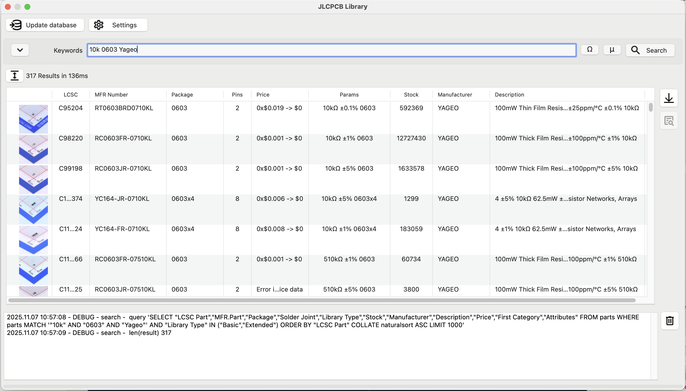
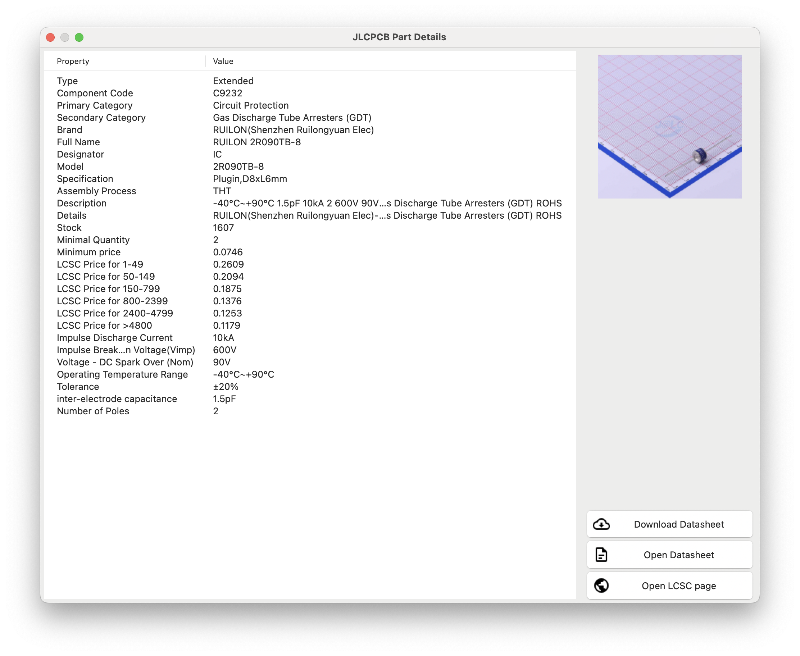
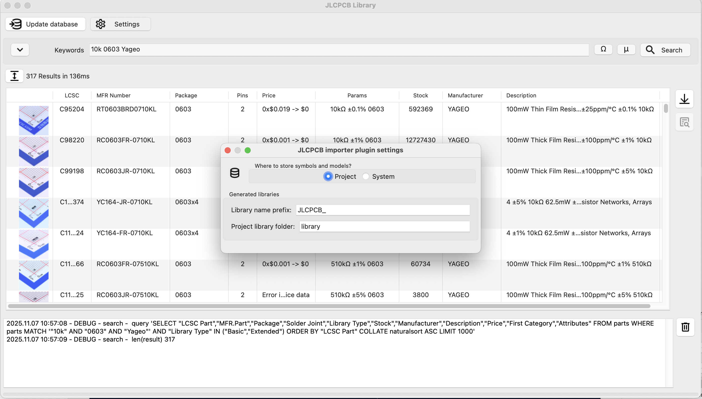
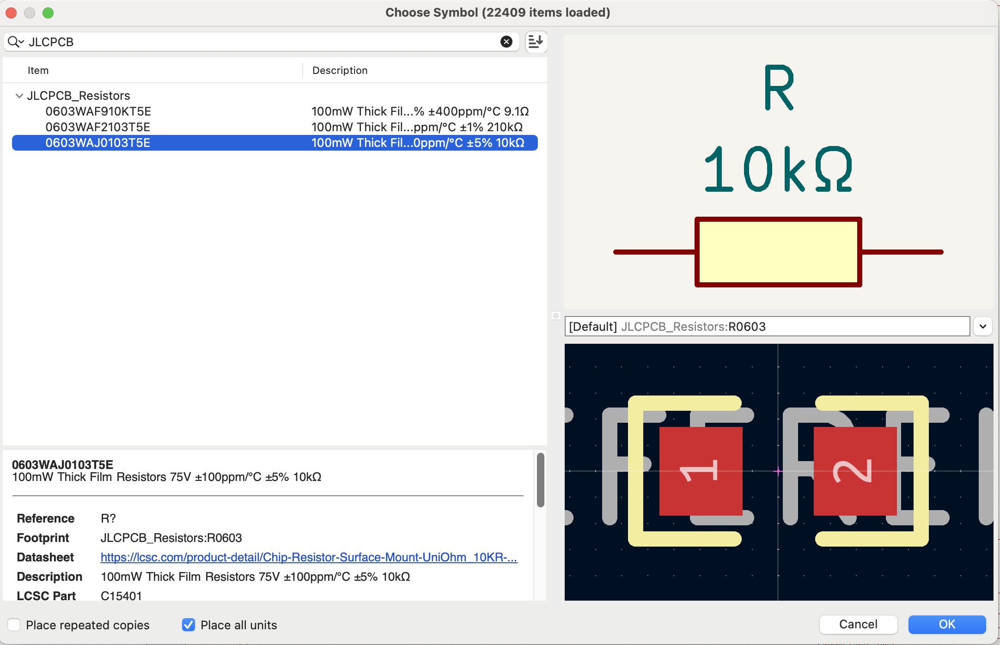
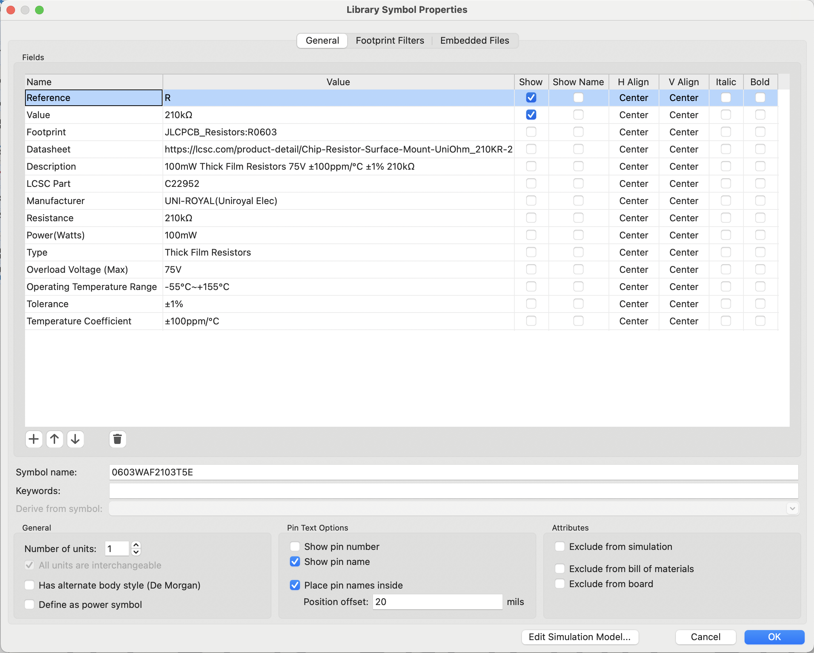
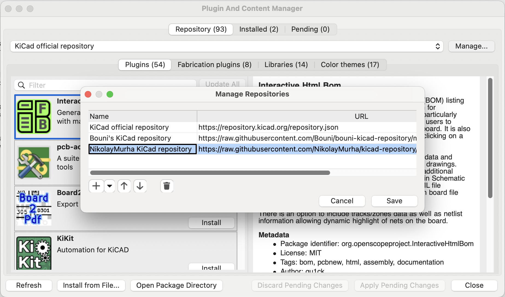

# KiCad JLCPCB Importer

<!-- markdownlint-disable MD013 -->

Thanks and credit to the original project that inspired this work:
[Bouni/bouni-kicad-repository](https://github.com/Bouni/bouni-kicad-repository)

- Supported platforms: Linux, macOS, and Windows
- Supported KiCad versions: KiCad 9 and newer
- Python-level CI runs on all three platforms. KiCad GUI/runtime behavior is
  validated separately because KiCad is not installed in CI.

What it does

- Search LCSC/JLCPCB catalog and assign LCSC numbers to footprints
- Import symbols, footprints, and 3D models via the built-in EasyEDA Pro backend
- In `KiCad` output mode: try matching built-in KiCad symbols/footprints first (common R/C/L/diode/transistor/IC), then fallback to EasyEDA conversion
- Choose where to store generated libraries: Project or System (KiCad 9 3rd‑party locations)
- Auto‑update project library tables (sym‑lib‑table / fp‑lib‑table) and fix 3D paths
- Configurable library prefix (default: `JLCPCB`) and project library folder (default: `library`)

### KiCad-first mapping settings

When `general.lib_format = "kicad"`:

- `general.kicad_builtin_first` (default `true`) enables built-in KiCad lookup before EasyEDA fallback.
- Symbol index cache is persisted to plugin folder (`<plugin>/cache/kicad_symbol_index_v1.json`) with TTL.
- `general.kicad_symbol_index_ttl_sec` (default `86400`) controls symbol index cache lifetime.
- `general.kicad_symbol_index_max_libs` limits number of symbol libraries used for index building.
- `general.kicad_footprint_fuzzy_max_libs` / `general.kicad_footprint_fuzzy_max_files_per_lib` limit fuzzy footprint scanning.
- `general.kicad_symbol_map` maps logical component kinds (`resistor`, `capacitor`, `bjt`, `ic`, ...) to preferred symbol refs like `Device:R` or `Transistor_BJT:Q_NPN_BCE`.
- `general.kicad_footprint_map` can pin preferred footprint refs or libraries (supports `${package}` placeholder), for example:
  - `["Resistor_SMD:R_${package}_*"]`
  - `["Package_SO:SOIC-8_3.9x4.9mm_P1.27mm"]`

## Limitations

- KiCad 9 currently does not provide a Python API to force refresh or reload library tables (symbols/footprints) at runtime.
- After importing a component (and updating `sym-lib-table` / `fp-lib-table` on disk), restart KiCad or reopen the project to see newly added libraries in browsers and pickers.
- In System storage mode, KiCad auto‑scans configured 3rd‑party folders and applies your configured nickname prefix, but visibility in the current session may still require a restart.

## Known issues

- Footprints may not appear in the library browsers due to KiCad's `fp-info-cache`.
  - Workaround: after import, close KiCad, delete `fp-info-cache` in the project folder, then start KiCad again.

Screenshots

- Search: `images/search.png`



- Part details: `images/details.png`



- Settings: `images/settings.png`



- Symbol library: `images/symbol_library.png`



- Symbol properties: `images/symbol_properties.png`



## Installation 💾

### KiCAD PCM

Add my custom repo to *the Plugin and Content Manager*, the URL is:

```sh
https://raw.githubusercontent.com/NikolayMurha/kicad-repository/main/repository.json
```



From there you can install the plugin via the GUI.

### Git

Simply clone this repo into your `scripting/plugins` folder.

#### Linux

```sh
cd /home/{username}/.local/share/kicad/{version}/scripting/plugins
git clone https://github.com/NikolayMurha/kicad-jlcpcb-importer.git
```

#### macOS

```sh
cd ~/Documents/KiCad/{version}/scripting/plugins
git clone https://github.com/NikolayMurha/kicad-jlcpcb-importer.git
```

#### Windows (PowerShell)

```powershell
cd "$env:USERPROFILE\Documents\KiCad\{version}\scripting\plugins"
git clone https://github.com/NikolayMurha/kicad-jlcpcb-importer.git
```

You may need to create the `scripting/plugins` folder if it does not exist.

### Flatpak :warning:

The Flatpak installation of KiCad may not provide `pip`. The plugin first tries
its automatic dependency installer, including the Flatpak user Python location.
If that fails, run:

1. `flatpak run --command=sh org.kicad.KiCad`
2. `python -m ensurepip --upgrade`
3. `/var/data/python/bin/pip3 install --target ~/.local/share/kicad/9.0/scripting/plugins/kicad-jlcpcb-importer/lib requests pycryptodome`

Adjust the KiCad version and plugin directory name in step 3 when necessary.

## Usage 🥳

To access the plugin choose `Tools → External Plugins → JLCPCB Importer` from the *PCB Editor* menus

Checkout this screencast, it shows quickly how to use this plugin:

> Note: usage instructions are intentionally omitted for now.

## System library locations (KiCad 9)

When you choose System as the storage location, generated libraries are placed under KiCad’s 3rd‑party folders.

- macOS
  - `/Users/{user}/Documents/KiCad/9.0/3rdparty/symbols/{plugin_dir_name}`
  - `/Users/{user}/Documents/KiCad/9.0/3rdparty/footprints/{plugin_dir_name}`
  - `/Users/{user}/Documents/KiCad/9.0/3rdparty/3dmodels/{plugin_dir_name}`

- Linux
  - `~/.local/share/kicad/9.0/3rdparty/symbols/{plugin_dir_name}`
  - `~/.local/share/kicad/9.0/3rdparty/footprints/{plugin_dir_name}`
  - `~/.local/share/kicad/9.0/3rdparty/3dmodels/{plugin_dir_name}`

- Windows
  - `%USERPROFILE%\Documents\KiCad\9.0\3rdparty\symbols\{plugin_dir_name}`
  - `%USERPROFILE%\Documents\KiCad\9.0\3rdparty\footprints\{plugin_dir_name}`
  - `%USERPROFILE%\Documents\KiCad\9.0\3rdparty\3dmodels\{plugin_dir_name}`

## Icons

This plugin makes use of a lot of icons from the excellent [Material Design Icons](https://materialdesignicons.com/)

## Development

1. Fork repo
2. Git clone forked repo
3. Install pre-commit `pip install pre-commit`
4. Setup pre-commit `pre-commit run`
5. Create feature branch `git switch -c my-awesome-feature`
6. Make your changes
7. Commit your changes `git commit -m "Awesome new feature"`
8. Push to GitHub `git push`
9. Create PR

Make sure you make use of pre-commit hooks in order to format everything nicely with `black`
In the near future I'll add `ruff` / `pylint` and possibly other pre-commit-hooks that enforce nice and clean code style.

## Notes

- This fork focuses on searching LCSC parts and managing KiCad library assignments with a bundled EasyEDA Pro importer.
- Fabrication (Gerber/CPL/BOM) features from the original tool are not included.

## python libraries

lib/ contains the necessary python packages that may not be a part of the KiCad python distribution.

These packages include:

- packaging

To install a package, such as 'packaging':

```python
pip install packaging --target ./lib
```

To update these packages:

```python
pip install packaging --upgrade --target ./lib
```

Future versions of KiCad may have support for a requires.txt to automate this process.

## Standalone mode

Allows the plugin UI to be started without KiCAD, enabling debugging with an IDE like pycharm / vscode.

Standalone mode is under development.

### Standalone limitations

- All board / footprint / value data are hardcoded stubs, see standalone_impl.py

### How to use

To use the plugin in standlone mode you'll need to identify three pieces of information specific to your Kicad version, plugin path, and OS.

#### Python

The `{KiCad python}` should be used, this can be found at different locations depending on your system:

| OS | Kicad python |
|---|---|
|Mac| /Applications/KiCad/KiCad.app/Contents/Frameworks/Python.framework/Versions/3.9/bin/python3 |
|Linux| /usr/bin/python3 |
|Windows| C:\Program Files\KiCad\{version}\bin\python.exe |

#### Working directory

The `{working directory}` should be your plugins directory, ie:

| OS | Working dir |
|---|---|
|Mac| ~/Documents/KiCad/{version}/scripting/plugins/ |
|Linux| ~/.local/share/kicad/{version}/scripting/plugins/ |
|Windows| %USERPROFILE%\Documents\KiCad\{version}\scripting\plugins\ |

> [!NOTE]  
> `{version}` is 9.0 or newer.

#### Plugin folder name

The `{kicad-jlcpcb-importer folder name}` should be the name of the kicad-jlcpcb-importer folder.

- For Kicad managed plugins this may be like

> com_github_nikolaymurha_kicad-jlcpcb-importer

- If you are developing kicad-jlcpcb-importer this is the folder you cloned the kicad-jlcpcb-importer as.

#### Command line

- Change to the working directory as noted above.
- Run the python interpreter with the `{kicad-jlcpcb-importer folder name}` folder as a module.

For example:

```sh
cd {working directory}
{kicad_python} -m {kicad-jlcpcb-importer folder name}
```

For example on Mac:

```sh
/Applications/KiCad/KiCad.app/Contents/Frameworks/Python.framework/Versions/3.9/bin/python3 -m kicad-jlcpcb-importer
```

For example on Linux:

```sh
cd ~/.local/share/kicad/9.0/scripting/plugins/ && python -m kicad-jlcpcb-importer
```

For example on Windows PowerShell:

```powershell
cd "$env:USERPROFILE\Documents\KiCad\9.0\scripting\plugins"
& "C:\Program Files\KiCad\9.0\bin\python.exe" -m kicad-jlcpcb-importer
```

#### IDE

- Configure the command line to be '{kicad_python} -m {kicad-jlcpcb-importer folder name}'
- Set the working directory to {working directory}

If using PyCharm or JetBrains IDEs, set the interpreter to KiCad's python, `{Kicad python}` and under 'run configuration' select Python.

Click on 'script path' and change instead to 'module name',
entering the name of the kicad-jlcpcb-importer folder, `{kicad-jlcpcb-importer folder name}`.
